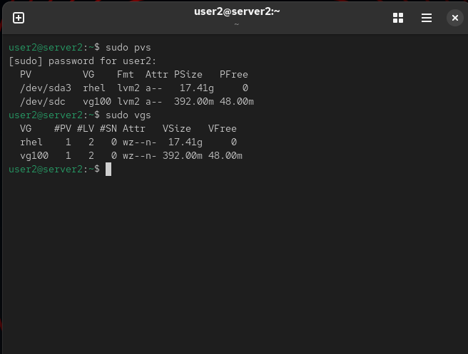
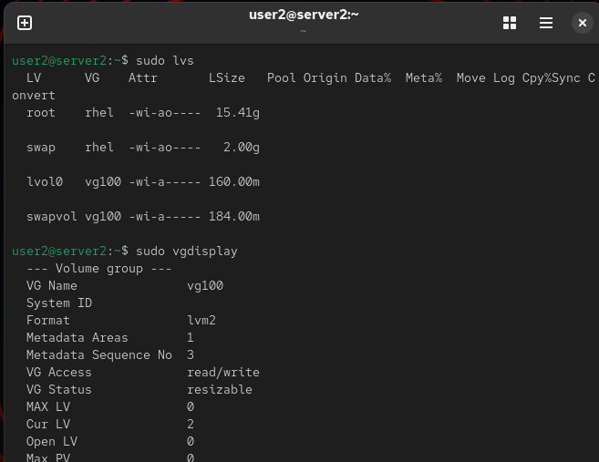
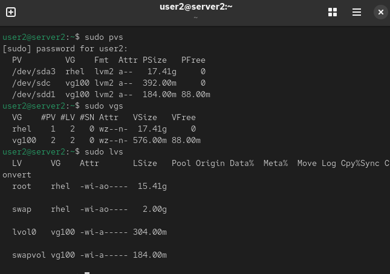

# Storage

This section documents my hands-on RHCSA storage administration labs completed on Red Hat Enterprise Linux 10.

## Topics Covered

- Creating and removing GPT partitions with `parted`
- Initializing Physical Volumes (PVs)
- Creating Volume Groups (VGs)
- Creating Logical Volumes (LVs)
- Extending Volume Groups
- Extending Logical Volumes
- Removing Volume Groups and Physical Volumes

## Labs

- Lab 01 – Create and Remove Partitions with Parted
- Lab 02 – Create Volume Groups and Logical Volumes
- Lab 03 – Extend Volume Groups and Logical Volumes
- Lab 04 – Remove Volume Groups and Physical Volumes

## Skills Demonstrated

- Disk partitioning
- LVM administration
- Storage verification
- Linux command-line administration

## Screenshots

### Figure 1 – Physical Volume and Volume Group

The output of `pvs` and `vgs` confirms that the Physical Volume was successfully initialized and added to the Volume Group.

---

### Figure 2 – Logical Volumes

The output of `lvs` and `vgdisplay` confirms that both Logical Volumes were successfully created within `vg100`.

## Screenshots

### Figure 1 – Expanded Volume Group and Logical Volume

The output of `pvs`, `vgs`, and `lvs` confirms that the new Physical Volume (`/dev/sdd1`) was successfully added to `vg100` and that `lvol0` was expanded from 160 MiB to approximately 304 MiB.